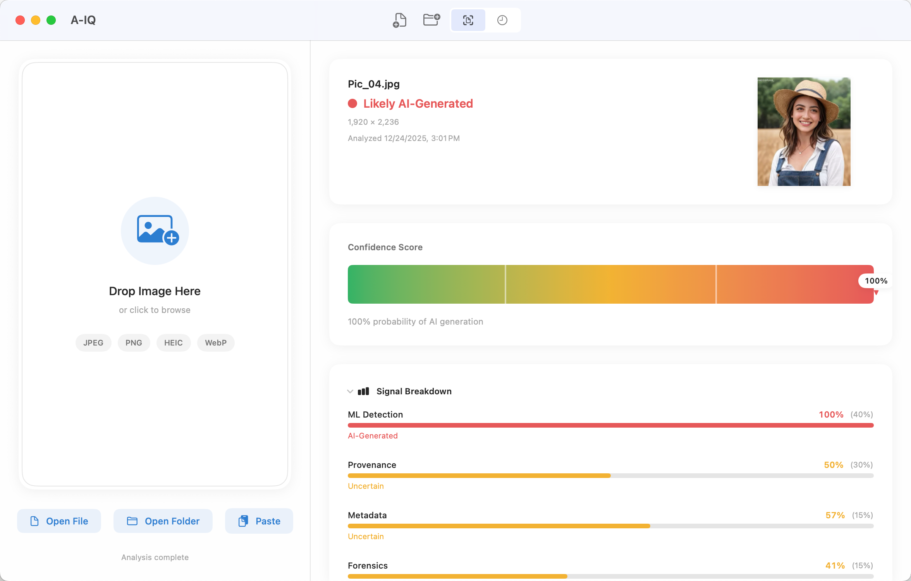
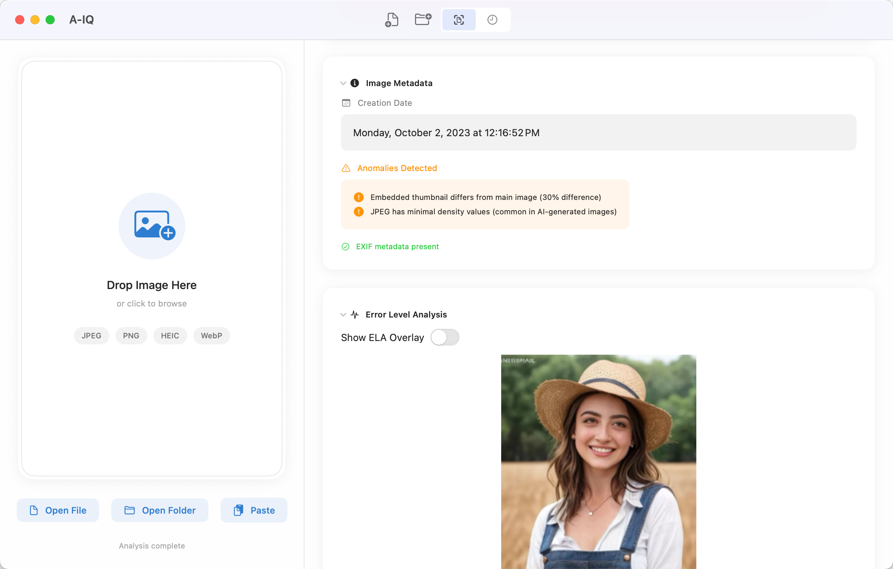
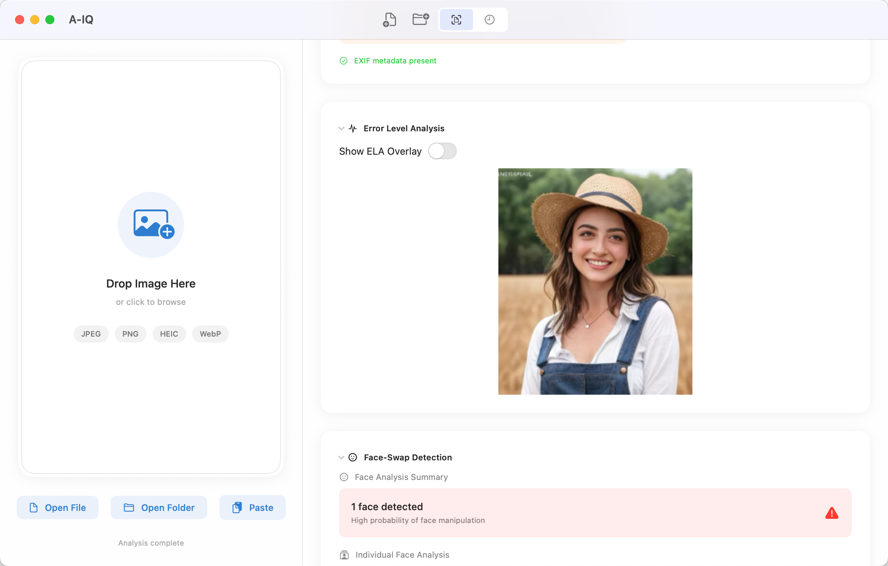
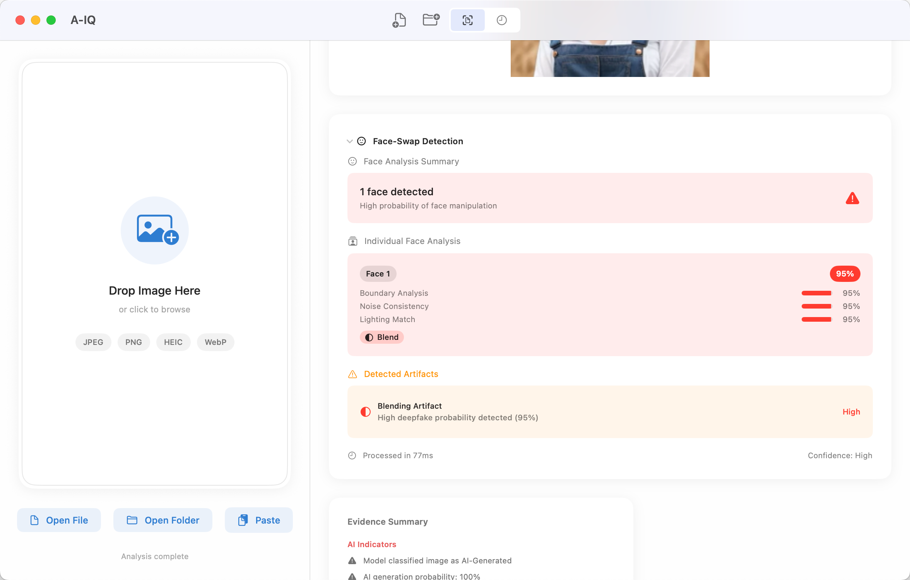
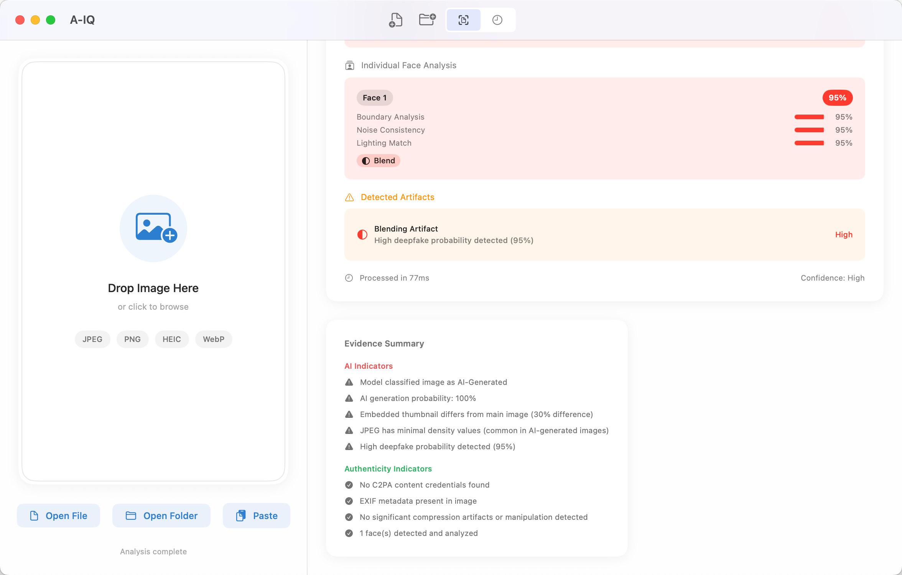

# A-IQ: AI Image Detection for macOS

A powerful, privacy-focused macOS application that detects AI-generated images using advanced machine learning and forensic analysis. A-IQ combines five independent detection methods to provide reliable results — all while processing images entirely on your device.



### 100% Local Processing — Your Photos Never Leave Your Mac

Unlike web-based AI detectors that upload your images to remote servers, **A-IQ runs entirely on your device**. Your photos are analyzed locally using your Mac's Neural Engine — nothing is ever sent to the cloud.

- ✓ No account required
- ✓ No internet connection needed
- ✓ No data collection or analytics
- ✓ No privacy concerns

**Your images stay on your Mac. Period.**

## Quick Start

### Simple Workflow

1. **Drag** any image onto A-IQ
2. **Drop** it in the analysis window
3. **Get** an instant AI probability score

Analysis typically completes in under 3 seconds.

### Multiple Input Methods

| Method | How |
|--------|-----|
| **Drag and Drop** | Drag any image onto the A-IQ window |
| **Open File** | Click "Open File" or press `Cmd+O` |
| **Paste** | Copy an image and press `Cmd+V` |
| **Batch Analysis** | Select "Open Folder" to analyze multiple images |

## Multi-Signal Detection

A-IQ doesn't rely on a single method — it combines **five independent detection signals** for maximum accuracy:

| Signal | Default Weight | With Faces | Method |
|--------|----------------|------------|--------|
| **ML Detection** | 40% | 35% | SigLIP Vision Transformer neural network |
| **Provenance** | 30% | 25% | C2PA content credentials verification |
| **Metadata** | 15% | 10% | EXIF/IPTC anomaly analysis |
| **Forensics** | 15% | 10% | Error Level Analysis (ELA) + FFT |
| **Face-Swap** | — | 20% | Deepfake detection (Vision + ML) |

*When faces are detected, weights automatically redistribute to include face-swap analysis.*

## Understanding Results

A-IQ provides a confidence score from 0-100%:

| Score | Classification | Meaning |
|-------|---------------|---------|
| < 30% | **Likely Authentic** | Low probability of AI generation |
| 30-70% | **Uncertain** | Review recommended |
| > 70% | **Likely AI-Generated** | High probability of AI generation |
| 100% | **Confirmed AI-Generated** | C2PA credentials prove AI origin |

Each analysis includes:
- **Overall AI Probability Score** (0-100%)
- **Classification**: Likely Authentic, Uncertain, or Likely AI-Generated
- **Signal Breakdown**: See how each detection method contributed
- **Evidence Summary**: Specific indicators found in the image
- **Visual Forensics**: View ELA overlays to see detected anomalies

### Analysis Examples

| Signal Breakdown | Image Metadata | Error Level Analysis |
|-----------------|------------------|------------------|
|  |  |  |

| Face-swap Detection | Evidence Summary |
|---------------------|----------------|
|  |  |

## How Detection Works

### 1. Neural Network Analysis (40% weight)

A-IQ uses **SigLIP** (Sigmoid Loss Image-Language Pretraining), a state-of-the-art vision transformer. This advanced neural network recognizes subtle patterns that distinguish AI-generated content from authentic photographs.

**Technical Details:**
- Architecture: Vision Transformer (ViT)
- Input: 224×224 pixels (center crop)
- Output: [AI probability, Human probability]
- Hardware: Neural Engine on Apple Silicon, GPU fallback on Intel
- Timeout: 2.0 seconds
- Detects content from DALL-E, Midjourney, Stable Diffusion, Flux, Adobe Firefly, and 60+ other AI generators

### 2. Content Credentials (C2PA) Verification (30% weight)

A-IQ performs **deep C2PA analysis** using the industry-standard Content Authenticity Initiative protocol backed by Adobe, Microsoft, Google, and the BBC.

**Core Verification:**
- Cryptographic signature validation against trusted signer database
- Detection of 60+ AI tools in credential claims
- Definitive proof when valid credentials indicate AI origin

**Enhanced C2PA Parsing:**
- **AI Generation Assertions**: Parses `c2pa.ai_generative_info` and `c2pa.synthetic` for explicit AI disclosure
- **Model/Prompt Extraction**: Extracts AI model name, generation prompt, and parameters (cfg_scale, steps, seed)
- **Ingredient Analysis**: Detects AI-generated parent images in composites via `c2pa.ingredients`
- **Provenance Chain Scanning**: Identifies AI tool usage at any point in the image's history
- **Training Status**: Checks `c2pa.ai_training` assertions

**Nuanced Scoring:**
| Score | Condition |
|-------|-----------|
| 100% | Valid C2PA + known AI tool or explicit AI assertion |
| 95% | Explicit AI assertion (without valid credentials) |
| 85% | AI tool in provenance chain |
| 80% | Parent image is AI-generated |
| 70% | Tampered credentials |
| 50% | No credentials (neutral) |
| 20% | Valid non-AI credentials (likely authentic) |

### 3. Metadata Forensics (15% weight)

Deep inspection across multiple metadata layers:

**AI Software Detection (60+ signatures):**
- DALL-E, Midjourney, Stable Diffusion, Flux, Fooocus, ComfyUI, and many more
- AI pipeline software (Pillow, PyTorch, OpenCV, ImageMagick)

**Advanced Anomaly Detection:**
- **Missing EXIF**: No EXIF data in JPEG files (common in AI-generated images)
- **Timestamp Anomalies**: Future dates, pre-digital era dates, inconsistencies
- **Thumbnail Mismatch**: Compares embedded thumbnail to main image (>25% difference flagged)
- **Color Profile Analysis**: Detects generic/uncalibrated profiles, camera brand vs profile mismatches
- **JPEG Compression Analysis**: Identifies AI pipeline software, unusual JFIF density
- **XMP/IPTC Deep Inspection**: Scans for AI terms (prompts, cfg scale, sampler, seed, etc.)

### 4. Forensic Image Analysis (15% weight)

Combines traditional and frequency domain analysis:

**Error Level Analysis (ELA)** — Traditional Forensics (60% of forensic score)
- Recompresses image at 90% quality and computes pixel-by-pixel differences
- AI-generated images often show uniform compression patterns
- Edited photos show localized differences at manipulation boundaries

**FFT Frequency Spectrum Analysis** — Advanced Forensics (40% of forensic score)
- 2D Fast Fourier Transform via Accelerate vDSP for hardware acceleration
- Radial power spectrum analysis (azimuthal averaging)
- Power law fitting: natural images follow 1/f^n decay (slope typically -2 to -3)
- Spectral peak detection for GAN upsampling artifacts
- Detects anomalous frequency patterns that betray synthetic origin

**Constraints:**
- Max resolution: 3840×2160 (downscaled if larger)
- FFT size: Power of 2, max 512×512
- 3-second timeout

### 5. Face-Swap & Deepfake Detection (20% weight when faces present)

When A-IQ detects faces, it activates a dedicated **deepfake detection neural network** trained on the FaceForensics++ dataset (~94% accuracy).

**ML-Powered Detection:**
- Uses SigLIP Vision Transformer fine-tuned for face manipulation detection
- Each face extracted with 20% padding for context
- Resized to 224×224 and analyzed by DeepfakeDetector model
- Per-face probability scores with visual bounding boxes

**Dynamic Weight Behavior:**
- When faces detected: Adds 20% weight, other detectors reduce proportionally
- When no faces: Returns neutral result, original weights apply

**Per-Face Results:**
- Deepfake probability score (0-100%)
- Classification: Low (<30%), Medium (30-70%), High (>70%)
- Visual bounding box highlighting analyzed regions
- List of detected artifacts with severity

## Use Cases

- **Journalists & Fact-checkers**: Verify image authenticity before publishing
- **Content Moderators**: Screen submissions for AI-generated content
- **Photographers**: Prove your work is authentic
- **Researchers**: Analyze datasets for synthetic content
- **Security Professionals**: Investigate potential deepfakes
- **Anyone**: Satisfy curiosity about suspicious images

## Batch Processing

- **Folder scanning**: Analyze entire folders at once
- **Batch queue**: Process multiple images in parallel (max 4 concurrent)
- **History**: Review all past analyses with search and filtering
- **Export Reports**: Generate PDF or JSON reports

## Supported Formats

- JPEG / JPG
- PNG
- HEIC / HEIF
- WebP
- TIFF
- AVIF

## Key Features

- **Privacy-First**: All processing happens locally. No images uploaded to any server.
- **Offline Capable**: Works without an internet connection.
- **Native Performance**: Optimized for Apple Silicon with Neural Engine acceleration.
- **Batch Analysis**: Analyze entire folders of images.
- **Export Reports**: Generate PDF or JSON reports of findings.
- **History**: Browse and search past analysis results (max 1000 records).
- **Dark Mode**: Full support for macOS appearance modes.
- **Keyboard Shortcuts**: Power user workflows with keyboard shortcuts.

## Recent Improvements (v1.1 - December 2025)

### Critical Fixes
1. **Graceful Error Handling**: Replaced fatal errors with user-friendly dialogs
2. **Complete Menu Implementation**: All menu commands now functional
3. **Proper Task Cancellation**: Analysis can be cancelled without errors
4. **Comprehensive Error Handling**: All errors are caught and displayed appropriately
5. **Input Validation**: File size limits (100MB) and security improvements
6. **Constants Extraction**: Centralized configuration for easier maintenance

### Code Quality (v1.1)
- Centralized constants in `AnalysisConstants.swift`
- Improved error handling patterns
- Better security with path validation and symlink resolution
- Enhanced user feedback
- Removed dead code (unused variables in MetadataAnalyzer)
- Added helper methods for consistent optional handling in ResultAggregator
- Standardized use of `AnalysisConstants.neutralScore` for default values

## Requirements

- macOS 14.0 (Sonoma) or later
- Apple Silicon (M1/M2/M3/M4) recommended for best performance
- Intel Macs supported
- 400MB disk space
- No internet connection required

## Installation

### For End Users

1. Download `A-IQ.dmg` from the [Releases](https://github.com/hmohamed01/A-IQ/releases) page
2. Open the DMG and drag A-IQ.app to your Applications folder
3. Right-click A-IQ.app → "Open" on first launch (macOS security)
4. Launch normally afterward

**Note**: The DMG contains all required models and resources. No additional downloads needed.

## Architecture

A-IQ is built as a native macOS app using SwiftUI and modern concurrency patterns:

```
A-IQ/
├── App/           # Application entry point and state
├── Analysis/      # Orchestration and result aggregation
├── Detectors/     # ML, Provenance, Metadata, Forensic, FaceSwap analyzers
├── Models/        # Data structures and protocols
├── Views/         # SwiftUI interface
├── Input/         # Image acquisition (file, clipboard, drag-drop)
├── Storage/       # SwiftData persistence
├── Export/        # PDF/JSON report generation
├── Settings/      # User preferences
└── Resources/     # ML model, c2patool, trust list
```

### Technical Highlights

**Concurrency Model:**
- Actor-based architecture for thread safety
- Parallel detector execution via `async let`
- Max 4 concurrent analyses with memory throttling (2GB limit)
- Cancellable analysis tasks with proper cleanup

**Performance:**
- Neural Engine acceleration on Apple Silicon
- GPU fallback on Intel Macs
- Large images downscaled to 4K for forensic analysis
- Lazy model loading to reduce startup time

**Storage:**
- SwiftData for analysis history
- Max 1000 records with automatic cleanup
- JPEG-compressed thumbnails (70% quality)
- Full results stored as JSON

**Security:**
- Path validation with symlink resolution prevents path traversal
- File size limits (100MB maximum)
- Input sanitization for all file paths
- Sandboxed external tool execution (c2patool)

## Building from Source

### For Developers

**Important**: The repository does not include large binary files (ML models, c2patool). You must download these separately before building.

### Prerequisites

- Xcode 15.0 or later
- macOS 14.0 SDK
- Git

### Step 1: Clone Repository

```bash
git clone https://github.com/hmohamed01/A-IQ.git
cd A-IQ
```

### Step 2: Download Required Resources

The following files are **required** but not included in the repository (too large for GitHub):

1. **ML Model** (`AIDetector.mlmodelc`) - 164MB
   - SigLIP Vision Transformer for AI detection
   - Place in `A-IQ/Resources/AIDetector.mlmodelc`

2. **Deepfake Model** (`DeepfakeDetector.mlmodelc`) - 164MB
   - SigLIP Vision Transformer for face-swap detection
   - Source: [prithivMLmods/deepfake-detector-model-v1](https://huggingface.co/prithivMLmods/deepfake-detector-model-v1)
   - Place in `A-IQ/Resources/DeepfakeDetector.mlmodelc`

3. **c2patool** binary - 34MB
   - Download from [C2PA releases](https://github.com/contentauth/c2patool/releases)
   - Place in `A-IQ/Resources/c2patool`
   - Set executable: `chmod +x A-IQ/Resources/c2patool`

4. **Trust List** (`trust_list.json`)
   - JSON file listing trusted C2PA signers
   - Place in `A-IQ/Resources/trust_list.json`

### Step 3: Build the App

**Command Line:**
```bash
xcodebuild build -scheme A-IQ -configuration Release -destination 'platform=macOS'
```

**Xcode:**
```bash
open A-IQ.xcodeproj
# Then Product → Build (⌘B)
```

The built app will be in `build/Build/Products/Release/A-IQ.app`

### Step 4: Create DMG Installer (Optional)

```bash
bash scripts/package.sh
```

This creates `dist/A-IQ.dmg` with styled background and Applications symlink.

## Configuration

### Settings

Access via A-IQ → Settings or ⌘,:

- **Sensitivity Threshold**: Adjust detection sensitivity (0.0-1.0)
- **Export Format**: Default format for reports (PDF/JSON)
- **Auto-Analyze on Drop**: Automatically analyze dropped images
- **Store Thumbnails**: Enable/disable thumbnail storage in history
- **History Retention**: Days to keep history (0 = forever)

### Constants

Key configuration values are centralized in `Models/AnalysisConstants.swift`:

- `maxConcurrentAnalyses`: Maximum parallel analyses (default: 4)
- `memoryThresholdBytes`: Memory limit for throttling (default: 2GB)
- `likelyAuthenticThreshold`: Score threshold for authentic (default: 0.30)
- `likelyAIGeneratedThreshold`: Score threshold for AI (default: 0.70)

## Privacy Promise

A-IQ is built on a simple principle: **your photos are yours**.

- No analytics or telemetry
- No network requests
- No data collection
- Works completely offline after installation
- Full macOS app sandbox with minimal permissions

In an age of data harvesting and privacy erosion, A-IQ lets you detect AI images without sacrificing your privacy.

## License

MIT License - See LICENSE file for details.

## Acknowledgments

- [C2PA](https://c2pa.org/) for the content provenance standard
- [Content Authenticity Initiative](https://contentauthenticity.org/) for c2patool
- [SigLIP](https://arxiv.org/abs/2303.15343) research for the vision transformer architecture
- Research community for advances in synthetic media detection

---

**Version**: 1.1
**Last Updated**: December 2025
